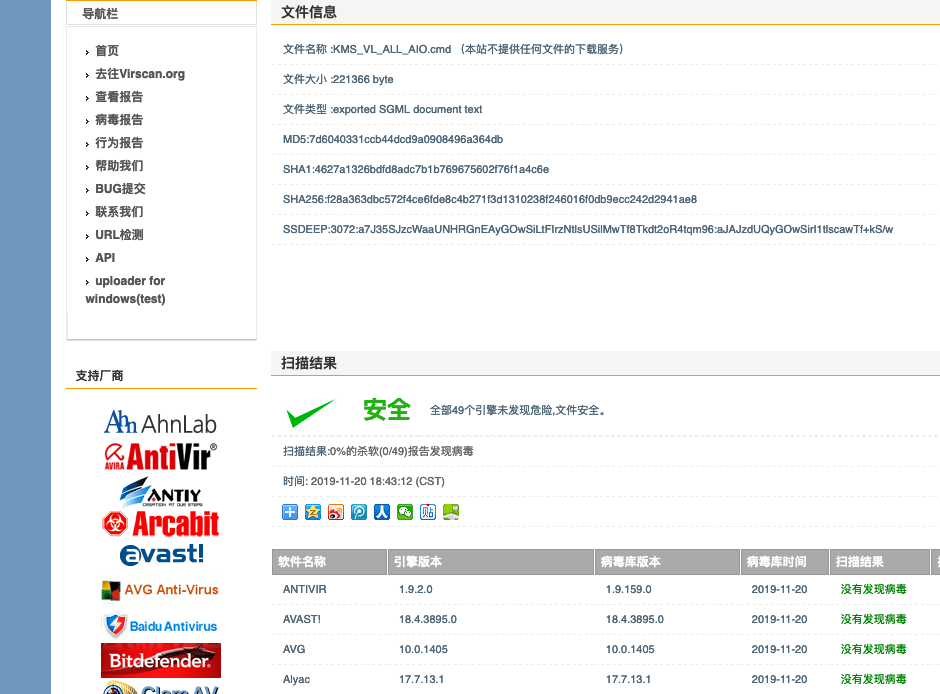

# Windows-Office

"<i>If you have a goal, then you will find a way to achieve it.</i>"

<h4 align="center">Win10，Office系列，激活cmd脚本实现KMS.</h4>

 

  
  
  

  Created by
  <a href="http://grj321.com">gaoljhy</a> and
  <a href="https://github.com/gaoljhy/Windows-Office/contributors">
    contributors
  </a>

 

****

## 使用

直接运行 `KMS.cmd` 文件即可

## virscan 扫描结果

